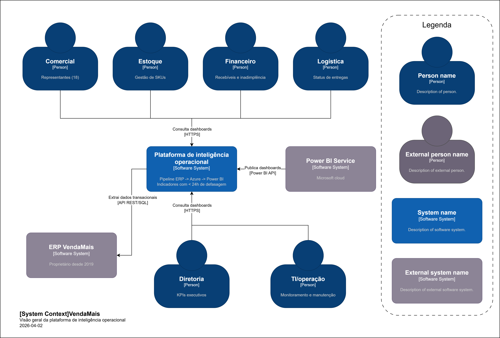

# C4 Model — Nível 1: Diagrama de Contexto

## Visão Geral

O diagrama de contexto (Nível 1) apresenta a **Plataforma de Inteligência Operacional VendaMais** e como ela se relaciona com os usuários das áreas de negócio e os sistemas externos. O objetivo é delimitar as fronteiras do sistema e mostrar quem interage com ele e de que forma.

## Diagrama

## Descrição dos Elementos

### Usuários (Persons)

| Ator | Papel | Interação com o Sistema |
|------|-------|------------------------|
| **Equipe Comercial** | 18 representantes distribuídos em 4 estados | Consulta dashboards de faturamento, ticket médio, ranking de clientes e evolução mensal |
| **Equipe de Estoque** | Responsável pelo controle de inventário | Monitora cobertura de estoque em dias, itens abaixo do ponto de reposição e giro por categoria |
| **Equipe Financeira** | Gestão de recebíveis e inadimplência | Acompanha taxa de inadimplência, aging de recebíveis e receita realizada vs. prevista |
| **Equipe de Logística** | Gestão de entregas e transportadoras | Consulta on-time delivery (%), pedidos em atraso e tempo médio de entrega por região |
| **Diretoria** | Tomada de decisão estratégica | Visualiza KPIs executivos consolidados com dados atualizados (máx. 24h de defasagem) |
| **Equipe de TI** | Administração da infraestrutura | Monitora pipelines, gerencia alertas e mantém a plataforma operacional |

### Sistemas Externos

| Sistema | Descrição | Protocolo |
|---------|-----------|-----------|
| **ERP Proprietário** | Sistema legado desde 2019 com módulos de Vendas, Estoque, Financeiro e Logística. Processa ~3.500 pedidos/mês | API REST / Conexão SQL |
| **Microsoft Azure** | Plataforma de nuvem que hospeda todo o pipeline de dados (Functions, Blob Storage, SQL Database) | Azure SDK / HTTPS |
| **Power BI Service** | Serviço de BI que publica dashboards interativos com atualização automática diária | Power BI REST API |

### Relações Principais

1. **Usuários → Plataforma**: Todas as áreas de negócio acessam dashboards via navegador web (HTTPS)
2. **Plataforma → ERP**: Extração diária automatizada de dados transacionais via API REST ou conexão SQL direta
3. **Plataforma → Azure**: Pipeline de dados executado inteiramente na nuvem Azure
4. **Plataforma → Power BI**: Publicação de dashboards e datasets para consumo pelos usuários finais
