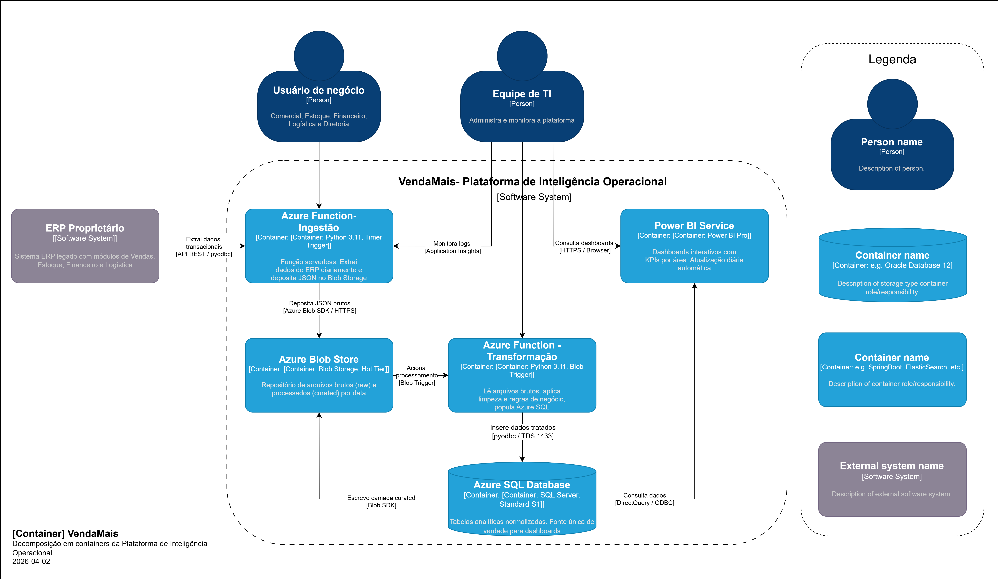

# C4 Model — Nível 2: Diagrama de Container

## Visão Geral

O diagrama de container (Nível 2) decompõe a **Plataforma de Inteligência Operacional VendaMais** nos seus cinco containers principais, detalhando as tecnologias utilizadas, responsabilidades de cada componente e os protocolos de comunicação entre eles.

## Diagrama



## Descrição dos Containers

### 1. Azure Function — Ingestão

| Atributo | Detalhe |
|----------|---------|
| **Tecnologia** | Azure Functions v4, Python 3.11, Timer Trigger |
| **Trigger** | Cron schedule diário (`0 0 2 * * *` — 02:00 UTC) |
| **Responsabilidade** | Conectar na API/banco do ERP proprietário, extrair os registros transacionais do dia (vendas, estoque, financeiro, logística) e depositar os dados como arquivos JSON no Azure Blob Storage (camada raw) |
| **Dependências** | `azure-functions`, `azure-storage-blob`, `pyodbc`, `requests` |
| **Saída** | Arquivos JSON no container `raw/{modulo}/{YYYY}/{MM}/{DD}/` |

### 2. Azure Blob Storage

| Atributo | Detalhe |
|----------|---------|
| **Tecnologia** | Azure Blob Storage, Hot Access Tier |
| **Estrutura** | Dois containers lógicos: `raw` (dados brutos) e `curated` (dados processados) |
| **Responsabilidade** | Repositório centralizado de arquivos, organizado por data de extração. Garante rastreabilidade e histórico dos dados extraídos |
| **Organização** | `raw/{modulo}/{YYYY}/{MM}/{DD}/{arquivo}.json` e `curated/{modulo}/{YYYY}/{MM}/{DD}/{arquivo}.parquet` |
| **Retenção** | Dados brutos mantidos por 90 dias; dados curated mantidos por 1 ano |

### 3. Azure Function — Transformação

| Atributo | Detalhe |
|----------|---------|
| **Tecnologia** | Azure Functions v4, Python 3.11, Blob Trigger |
| **Trigger** | Blob Trigger — acionada automaticamente quando novos arquivos chegam na camada raw |
| **Responsabilidade** | Ler os arquivos brutos do Blob Storage, aplicar regras de limpeza (remoção de duplicatas, validação de tipos, tratamento de nulos), aplicar regras de negócio e popular o Azure SQL Database com dados tratados |
| **Dependências** | `azure-functions`, `azure-storage-blob`, `pyodbc`, `pandas` |
| **Saída** | Registros inseridos/atualizados no Azure SQL Database + arquivos processados na camada `curated` |

### 4. Azure SQL Database

| Atributo | Detalhe |
|----------|---------|
| **Tecnologia** | Azure SQL Database, Tier Standard S1 (20 DTUs) |
| **Responsabilidade** | Armazenar dados analíticos tratados e normalizados em tabelas relacionais. Servir como fonte única de verdade (single source of truth) para os dashboards Power BI |
| **Schemas** | `vendas`, `estoque`, `financeiro`, `logistica`, `dw` (dimensões e fatos) |
| **Segurança** | Azure AD Authentication, TDE (Transparent Data Encryption), firewall rules por IP |
| **Backup** | Backup automático Azure com retenção de 7 dias (PITR) |

### 5. Power BI Service

| Atributo | Detalhe |
|----------|---------|
| **Tecnologia** | Power BI Pro, publicação via Power BI Service |
| **Responsabilidade** | Dashboards interativos publicados com KPIs prioritários de cada área de negócio (Vendas, Estoque, Financeiro, Logística) e visão executiva consolidada para a Diretoria |
| **Conexão** | DirectQuery ou Import Mode via ODBC para o Azure SQL Database |
| **Atualização** | Scheduled Refresh diário (06:00 UTC) |
| **Dashboards** | Vendas (faturamento, ticket médio, ranking), Estoque (cobertura, reposição, giro), Financeiro (inadimplência, aging), Logística (OTD, atrasos), Executivo (KPIs consolidados) |

## Fluxo de Dados (Pipeline)

```
ERP Proprietário
    │
    │ API REST / pyodbc (extração diária às 02:00 UTC)
    ▼
Azure Function - Ingestão
    │
    │ Azure Blob SDK (HTTPS)
    ▼
Azure Blob Storage (camada raw)
    │
    │ Blob Trigger (automático)
    ▼
Azure Function - Transformação
    │
    │ pyodbc (TDS/TCP 1433)           Azure Blob SDK
    ▼                                      ▼
Azure SQL Database              Blob Storage (camada curated)
    │
    │ DirectQuery / ODBC (TDS/TCP 1433)
    ▼
Power BI Service → Usuários de Negócio
```

## Protocolos de Comunicação

| Origem | Destino | Protocolo | Porta | Descrição |
|--------|---------|-----------|-------|-----------|
| Function Ingestão | ERP | API REST / pyodbc | 443 / 1433 | Extração de dados transacionais |
| Function Ingestão | Blob Storage | Azure Blob SDK | 443 (HTTPS) | Upload de arquivos JSON brutos |
| Function Transformação | Blob Storage | Blob Trigger + SDK | 443 (HTTPS) | Leitura raw / escrita curated |
| Function Transformação | SQL Database | pyodbc | 1433 (TDS) | Insert/Upsert de dados tratados |
| Power BI | SQL Database | DirectQuery/ODBC | 1433 (TDS) | Consulta de dados para dashboards |
| Usuários | Power BI | HTTPS | 443 | Acesso aos dashboards via browser |
| TI | Azure Portal | HTTPS | 443 | Monitoramento e administração |
